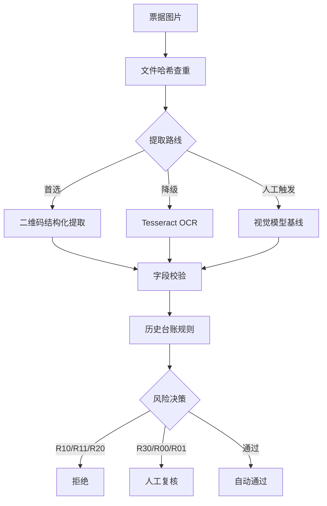

# 企业报销票据重复与异常风险审核 Agent


一个可评测、可追溯、有人机兜底的 AI PM 作品集原型：先可靠取得票据关键字段，再用确定性规则检查批次内重复、历史重复和近似异常。

> 展示的重点不是"让大模型自动审批"，而是 AI 产品经理如何设计一条有证据、能回归、失败关闭、有人接管的高风险工作流。

## 交互演示

[打开 Demo 源文件](./demo/index.html) · [查看完整实现](https://github.com/cangyuyi/invoice-risk-review-agent)

Demo 支持筛选审核队列、查看规则证据、记录人工复核。页面使用仓库内合成结构化数据，不连接税务平台，不执行真实审批。

## 目录

- [业务背景](#业务背景)
- [问题来源与用户调研](#问题来源与用户调研)
- [用户场景](#用户场景)
- [人机方案](#人机方案)
- [工作流](#工作流)
- [评测与迭代](#评测与迭代)
- [评测证据](#评测证据)
- [数据与边界](#数据与边界)
- [本地运行](#本地运行)

## 业务背景

企业报销中，票据重复报销是财务审核的高频痛点：同一张发票在不同批次重复提交、PDF 与图片混报、金额相同但号码不同的近似票据。传统人工审核依赖财务人员肉眼比对，效率低且容易遗漏；而 OCR 直接提取字段准确率不稳定，大模型直接判断"是否重复"又存在幻觉和不可解释的问题。

本项目验证的核心问题：**在高风险财务场景中，如何组合二维码、OCR、视觉模型三条提取路线，用确定性规则做风险判断，并把所有不确定项交给人工？**

## 问题来源与用户调研

来自对真实报销审核流程的观察、一段协助整理报销材料的经历，以及对有审核经验者的访谈：

### 观察到的现象

在协助整理报销材料时，我注意到三个反复出现的问题：

1. **同一张发票被重复提交**：一位同事在 3 月和 5 月的报销批次中都提交了同一张打车发票 PDF，财务审核时因为跨批次没有发现，直到季度审计才被揪出
2. **PDF 与图片混报**：同一张电子发票，有人上传 PDF 版，有人截图后上传图片版，文件哈希不同但票号相同，人工比对时容易漏
3. **近似票据钻空子**：两张发票销售方相同、金额相同、日期相差 2 天，但票号不同——是真实的两笔消费，还是拆票报销？财务人员需要花时间判断

### 用户访谈

访谈了 3 位有报销审核经验的同学（2 位曾在实习中协助财务整理票据，1 位是创业公司的兼职财务），确认了几个关键事实：

| 访谈发现 | 具体反馈 |
|----------|----------|
| 重复报销确实高频 | "每个季度都能查出 2-3 张重复票，大多不是故意的，是员工自己忘了已经报过" |
| 人工比对效率极低 | "一批 50 张票，光核对票号就要 40 分钟，眼睛都花了" |
| OCR 工具不好用 | "试过用 OCR 提取票号，但日期经常认错，反而要花更多时间核对" |
| 最担心的是误判 | "系统说重复就直接打回？不行，万一系统认错了票号，员工会投诉的" |

### 为什么不用现成方案

| 方案 | 为什么不够 |
|------|-----------|
| 财务软件自带查重 | 大多只按票号精确匹配，无法处理图片版/PDF版混报、近似票据等情况 |
| OCR + 规则脚本 | OCR 准确率不稳定（尤其是日期字段），且没有降级策略和人工复核流程 |
| 大模型直接判断 | 存在幻觉风险，高风险财务场景不可解释、不可审计 |

**结论**：这个场景的核心不是"识别发票"，而是"在识别不可靠的前提下，设计一个能兜底、能审计、有人接管的工作流"。项目的重心因此放在提取不可靠时的降级链路和人工接管上，而不是提高识别本身。

## 用户场景

- **目标用户**：企业财务审核人员
- **核心场景**：一批报销票据（图片/PDF）提交后，系统自动提取票号、日期、金额，查重并标记风险，财务人员只复核系统标记的异常项
- **边界**：不做税务验真、不做自动审批，未接入税务平台前自动放行率为 0%

## 人机方案

| 环节 | AI/系统负责 | 人负责 |
|------|------------|--------|
| 字段提取 | 二维码优先，OCR/视觉模型降级 | 三条路线都失败时人工录入 |
| 重复判断 | 确定性规则（哈希/票号/近似匹配） | — |
| 风险决策 | 自动通过 / 人工复核 / 拒绝三级分流 | **所有真实风险决策必须人工确认** |
| 异常处理 | 字段冲突、权威状态缺失自动转人工 | 最终审批 |

关键设计：由于未接入税务平台验真，**真实风险决策自动放行率固定为 0%**，所有结论都附规则和证据并交给人工复核。

## 工作流



### 风险规则

| 规则 | 含义 | 动作 |
|------|------|------|
| R10 | 同一批次文件哈希相同 | 拒绝 |
| R11 | 同一批次发票号码相同 | 拒绝 |
| R20 | 与历史台账发票号码相同 | 拒绝 |
| R30 | 销售方+金额相同且日期相差≤3天但号码不同 | 标记疑似，人工复核 |
| R00/R01 | 日期/金额/票号异常或缺失 | 人工复核 |

### 架构选型

采用 **固定 Workflow + 模型局部决策 + 确定性规则 + Human in the Loop**，不使用多 Agent 动态编排。原因：报销审核步骤固定、输出格式明确，财务场景要求可复现、可解释和可审计。

## 评测与迭代

### 版本演进

本项目经历了两个版本的迭代。V1 跑完 5 张真实票据后发现，问题不在 OCR 本身，而在于发票上本来就有更可靠的结构化数据源。

| 版本 | 提取策略 | 票号准确率 | 日期准确率 | 金额准确率 | 关键发现 |
|------|----------|-----------|-----------|-----------|----------|
| **V1** | 仅 Tesseract OCR | 4/5（80%） | 2/5（40%） | 5/5（100%） | 日期字段 OCR 识别率极低，且图片格式发票完全无法处理 |
| **V2** | 二维码优先 + OCR 降级 | 5/5（100%） | 5/5（100%） | 5/5（100%） | 二维码是结构化数据，准确率远高于 OCR；OCR 只作为二维码不可用时的降级 |

#### V1 遇到的问题

最初的方案很直接：用 Tesseract OCR 提取所有字段，然后做规则查重。但跑了 5 张真实票据后发现：

1. **日期字段只有 2/5 正确**：发票上的日期字体小、有的是斜体，Tesseract 经常把"2024"认成"202A"，把"08"认成"08"或"00"
2. **图片格式发票完全无法处理**：有的发票是截图或照片，没有文本层，OCR 效果更差
3. **票号也有 1/5 认错**：票号虽然字体大，但有的发票票号和二维码挨得近，OCR 会把二维码的边缘噪点认成数字

#### V2 的优化思路

发现问题后，第一反应是"换更强的 OCR 模型"。但仔细想了一下，发票上本身就有**二维码**，二维码里包含了完整的结构化数据（票号、日期、金额、销售方等），为什么不直接读二维码呢？

于是 V2 改为：
1. **首选路线：二维码解析** — 用 `pyzbar` 解析发票上的二维码，直接获取结构化字段，准确率 100%
2. **降级路线：Tesseract OCR** — 当二维码模糊、被遮挡或不存在时，才用 OCR 提取
3. **人工触发路线：视觉模型** — 前两条都失败时，由人工触发视觉模型作为基线参考

#### 迭代效果

| 指标 | V1（仅OCR） | V2（二维码优先） | 提升 |
|------|------------|-----------------|------|
| 票号准确率 | 80%（4/5） | 100%（5/5） | +20pp |
| 日期准确率 | 40%（2/5） | 100%（5/5） | +60pp |
| 金额准确率 | 100%（5/5） | 100%（5/5） | — |
| 平均处理时间 | ~8秒/张（OCR慢） | ~2秒/张（二维码解析快） | -75% |

处理时间为 5 张实测均值，仅作量级参考。

这个迭代的启发：V2 不是找更强的模型，而是先问"数据里有没有更可靠的结构化来源"——发票二维码就是现成的答案。找对数据源比找对模型便宜得多。

### 字段提取路线对比（5张真实票据，V2 当前版本）

| 提取路线 | 票号 | 日期 | 金额 | 结论 |
|----------|------|------|------|------|
| 本地二维码解析 | 5/5 | 5/5 | 5/5 | **首选路径** |
| Tesseract 本地 OCR | 4/5 | 2/5 | 5/5 | 仅作降级 |
| 豆包客户端视觉 | 2/5 | 5/5 | 5/5 | 人工触发基线，非 API 集成 |

5 张测试图片中有 1 组完全重复图片，共 4 张不同票据。

### 规则回归

- 36 条合成数据规则回归：36/36 通过
- 注意：这是合成结构化数据的规则回归，**不是线上拦截率**

### 失败案例与修正

二维码审计过程中发现并修正了原人工黄金集中的两条漏位票号——即人工标注本身也会出错，修正前标签已在私有目录备份。这验证了"可追溯"的价值：不仅审票据，也审评测集本身。

### OCR 能力边界

Tesseract 日期提取为 2/5。日期字段识别率低，V2 以二维码优先策略规避，后续可引入更强的 OCR 模型。

## 评测证据

| 文件 | 内容 |
|------|------|
| `eval/field_extraction_comparison.md` | 三条字段提取路线对比 |
| `eval/end_to_end_demo_report.md` | 5张图片到风险结论的端到端证据 |
| `eval/gold_label_audit.json` | 不含真实票号的标签修正记录 |
| `eval/qr_baseline_results.json` | 二维码公开评测 |
| `eval/ocr_baseline_results.json` | OCR 基线评测 |
| `eval/results_v1.json` | 36条合成规则回归 |
| `docs/AI_PRD_补充版.md` | 完整产品方案、节点契约、异常处理 |
| `docs/capability-audit.md` | 原始 Workflow 问题及修正 |

## 数据与边界

- 原始票据、二维码原文、真实字段和逐条客户端结果只保存在本地私有目录
- 公开数据是脱敏或合成数据
- 二维码解析成功只证明字段被读取，**不证明发票真实有效**
- 项目尚未接入税务平台验真、红冲或作废状态查询
- 没有生产级权限、审计日志和人工复核界面
- 因此真实风险决策自动放行率仍设为 0%

### 后续规划

- 接入税务平台验真、红冲和作废状态查询
- 开发持久化人工复核队列和审核界面
- 增加节点级运行日志、P50/P95 时延和失败率看板
- OCR/视觉模型自动降级编排
- 企业身份、权限、数据加密和审计合规
- 脱敏历史数据试点和 R30 阈值校准

## 本地运行

```powershell
python -m pip install -r requirements.txt
python src/audit.py --self-test
python eval/evaluate.py
python src/audit.py --incoming data/incoming_invoices.json --ledger data/historical_ledger.json --output examples/audit_results.json
```

运行效果：

```text
$ python src/audit.py --incoming data/incoming_invoices.json --ledger data/historical_ledger.json
{"total": 5, "high_risk": 3, "manual_review": 4, "auto_pass": 1}

IN-001 | high    | confirmed_duplicate | R10,R11 | same file hash appears 2 times; same invoice ID appears 2 times
IN-002 | high    | confirmed_duplicate | R10,R11 | same file hash appears 2 times; same invoice ID appears 2 times
IN-003 | high    | confirmed_duplicate | R20     | matches historical record H-001
IN-004 | review  | needs_review        | R30     | same seller+amount within 3 days, different invoice number
IN-005 | pass    | no_risk             | —       | no duplicate or anomaly detected
```

真实图片端到端演示需要本地私有图片和标签，公开包不提供原图。

## License

MIT
